# PhenotypeToGeneDownloaderR: Comprehensive Gene Retrieval Pipeline


A comprehensive bioinformatics pipeline for downloading and analyzing genes associated with specific phenotypes from multiple biological databases. This package provides both R scripts for gene retrieval and Python analysis tools for comprehensive downstream analysis with publication-quality visualizations.

## 🔬 Overview

PhenotypeToGeneDownloaderR integrates multiple biological databases to provide a unified approach to phenotype-specific gene discovery and analysis. In the current repository state, there are **12 active database downloader scripts** plus a master coordinator.

1. **R Gene Retrieval Pipeline**: phenotype-first database retrieval
2. **Python Analysis Suite**: downstream overlap, frequency, enrichment, and summary analytics
3. **Standardized Output**: per-source CSVs plus combined outputs
4. **Publication-Quality Visualizations**: high-resolution plots and tabular reports

## 📊 Supported Databases

| Database | Script | Description | Gene Extraction Method |
|----------|--------|-------------|----------------------|
| **PubMed + PubTator3** | `pubmed.R` | Literature mining | PMID search + PubTator3 gene annotations |
| **OMIM** | `omim.R` | Mendelian disorders | OMIM API first, HTML scraping fallback |
| **STRING-DB** | `string_db.R` | Protein interactions | API-based interaction network analysis |
| **DisGeNET** | `disgenet.R` | Gene-disease associations | UMLS disease lookup + disease2gene scoring |
| **ClinVar** | `clinvar.R` | Clinical variants | NCBI ClinVar VCV XML structured parsing |
| **Reactome** | `reactome_pathways.R` | Biological pathways | Pathway title matching + gene mapping |
| **KEGG** | `kegg.R` | Pathways | Pathway-title scoring + direct GENE-field parsing |
| **HPO** | `hpo.R` | Human phenotypes | Local ontology/annotation matching + fallback known genes |
| **GTEx** | `gtex.R` | Gene expression | Dynamic tissue ranking by PubMed + eQTL filtering |
| **UniProt** | `uniprot.R` | Protein knowledgebase | Multi-query REST retrieval of reviewed human entries |
| **Open Targets** | `opentargets.R` | Disease-target associations | GraphQL disease search + associated targets pagination |
| **GWAS Catalog** | `gwasrapidd.R` | Variant-gene mappings | Expanded term search via EFO/reported trait APIs |

## 🚀 Quick Start

### Prerequisites

- **R** ≥ 4.0.0
- **Python** ≥ 3.8
- Internet connection for database access

### Installation

1. **Clone the repository:**
```bash
git clone https://github.com/MuhammadMuneeb007/PhenotypeToGeneDownloaderR.git
cd PhenotypeToGeneDownloaderR
```

2. **Install R dependencies:**
```r
Rscript requirements.R
```

3. **Install Python dependencies:**
```bash
pip install -r requirements.txt
# OR using conda:
conda env create -f environment.yml
conda activate gene-analysis
```

### Basic Usage

#### 1. Download Genes (R Pipeline)

Download genes for a specific phenotype from all databases:

```bash
# Download genes for migraine
Rscript download_genes.R migraine

# Download genes for diabetes
Rscript download_genes.R diabetes

# Force re-download (ignore existing files)
Rscript download_genes.R migraine --force
```

**Output:** Creates `AllPackagesGenes/` directory with CSV files:
- `migraine_pubmed_pubtator.csv`
- `migraine_pubmed_genes.csv`
- `migraine_omim_genes.csv`
- `migraine_string_db_genes.csv`
- ... (one file per database)

#### 2. Analyze Genes (Python Pipeline)

Run comprehensive analysis on downloaded genes:

```bash
# Analyze migraine genes
python download_genes_analysis.py migraine

# Analyze diabetes genes
python download_genes_analysis.py diabetes
```


### Core R Scripts (Active Downloaders)

#### 1. `pubmed.R` - PubMed + PubTator3
**Purpose**: Retrieves phenotype-linked publications, then extracts genes from PubTator3 annotations.

**Required Packages**: `httr`, `jsonlite`, `xml2`

**Command**: `Rscript pubmed.R <phenotype>`

**Primary outputs**:
- `{phenotype}_pubmed_pubtator.csv`
- `{phenotype}_pubmed_pubtator_detailed.csv`
- `{phenotype}_pubmed_pubtator_metadata.csv`
- `{phenotype}_pubmed_genes.csv`

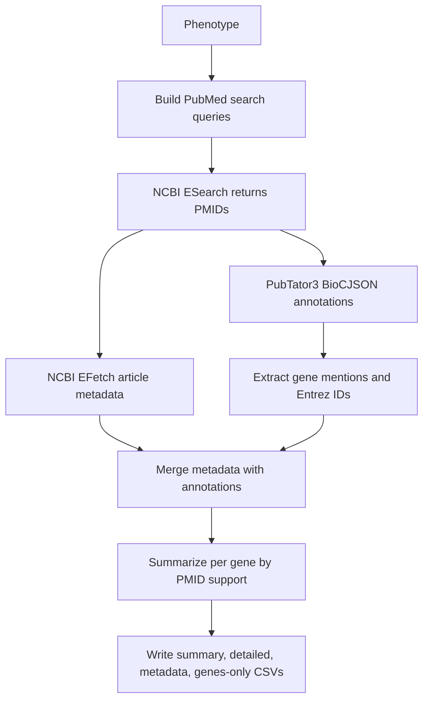

---

#### 2. `omim.R` - OMIM
**Purpose**: Uses OMIM API when available; falls back to OMIM web scraping if needed.

**Required Packages**: `httr`, `jsonlite`, `rvest`, `stringr`

**Command**: `Rscript omim.R <phenotype>`

**Primary outputs**:
- `{phenotype}_omim.csv`
- `{phenotype}_omim_genes.csv`

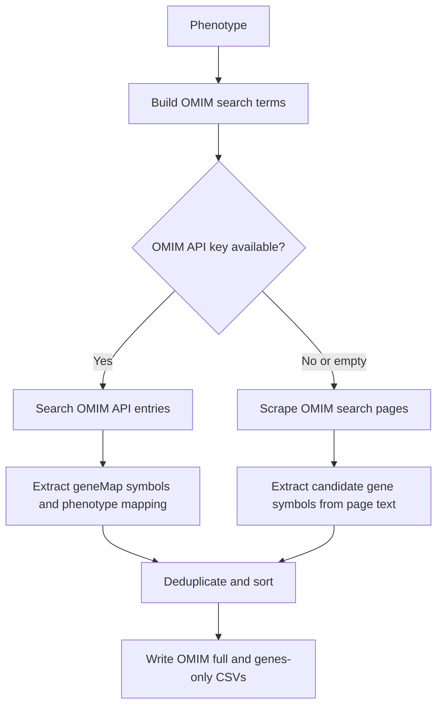

---

#### 3. `string_db.R` - STRING-DB
**Purpose**: Resolves phenotype text to STRING proteins, then expands via interaction partners.

**Required Packages**: `httr`, `jsonlite`

**Command**: `Rscript string_db.R <phenotype>`

**Primary outputs**:
- `{phenotype}_string_db.csv`
- `{phenotype}_string_db_genes.csv`

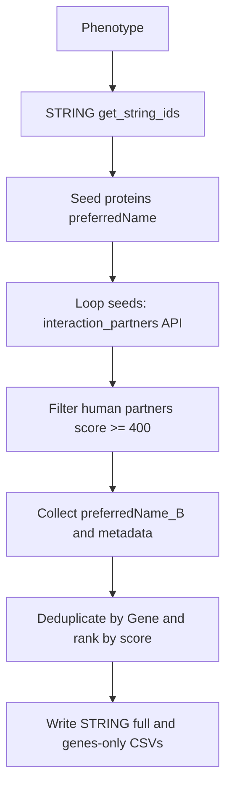

---

#### 4. `disgenet.R` - DisGeNET
**Purpose**: Resolves disease identifiers, then fetches scored gene-disease associations.

**Required Packages**: `dplyr`, `devtools`, `disgenet2r`

**Command**: `Rscript disgenet.R <phenotype> [database] [min_score] [max_score]`

**Primary outputs**:
- `{phenotype}_disgenet.csv`
- `{phenotype}_disgenet_genes.csv`

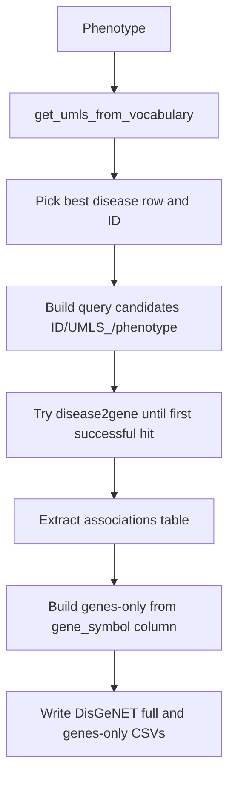

---

#### 5. `clinvar.R` - ClinVar Structured XML
**Purpose**: Searches ClinVar IDs and parses structured VCV XML fields for gene symbols.

**Required Packages**: `rentrez`, `xml2`, `dplyr`

**Command**: `Rscript clinvar.R <phenotype> [max_results]`

**Primary outputs**:
- `{phenotype}_clinvar.csv`
- `{phenotype}_clinvar_genes.csv`

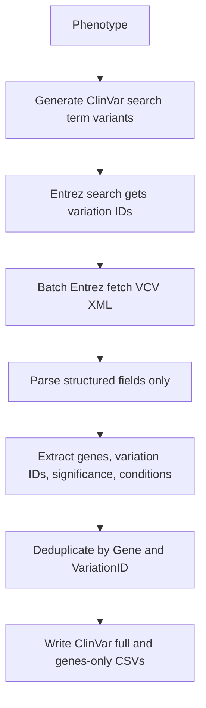

---

#### 6. `reactome_pathways.R` - Reactome
**Purpose**: Matches phenotype text to human Reactome pathway names, then maps pathway genes.

**Required Packages**: `ReactomePA`, `reactome.db`, `org.Hs.eg.db`, `AnnotationDbi`, `dplyr`, `stringr`

**Command**: `Rscript reactome_pathways.R <phenotype>`

**Primary outputs**:
- `{phenotype}_reactome_pathways.csv`
- `{phenotype}_reactome_pathways_genes.csv`

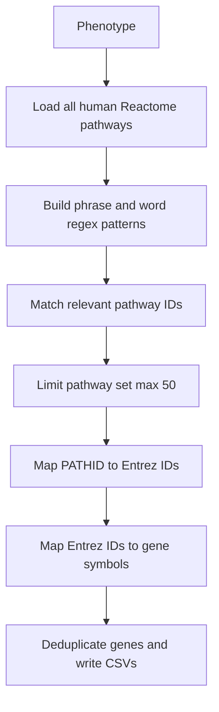

---

#### 7. `kegg.R` - KEGG
**Purpose**: Scores pathway-title relevance to phenotype, then parses genes directly from matched pathways.

**Required Packages**: `KEGGREST`

**Command**: `Rscript kegg.R <phenotype>`

**Primary outputs**:
- `{phenotype}_kegg.csv`
- `{phenotype}_kegg_genes.csv`
- `{phenotype}_kegg_pathways.csv`

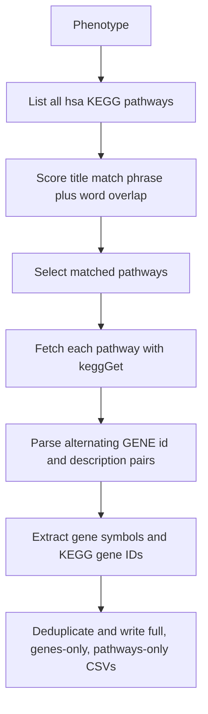

---

#### 8. `hpo.R` - Human Phenotype Ontology
**Purpose**: Uses downloaded HPO resources with cached parsing and pattern-based matching.

**Required Packages**: `ontologyIndex`, `httr`, `utils`

**Command**: `Rscript hpo.R <phenotype>`

**Primary outputs**:
- `{phenotype}_hpo.csv`
- `{phenotype}_hpo_genes.csv`

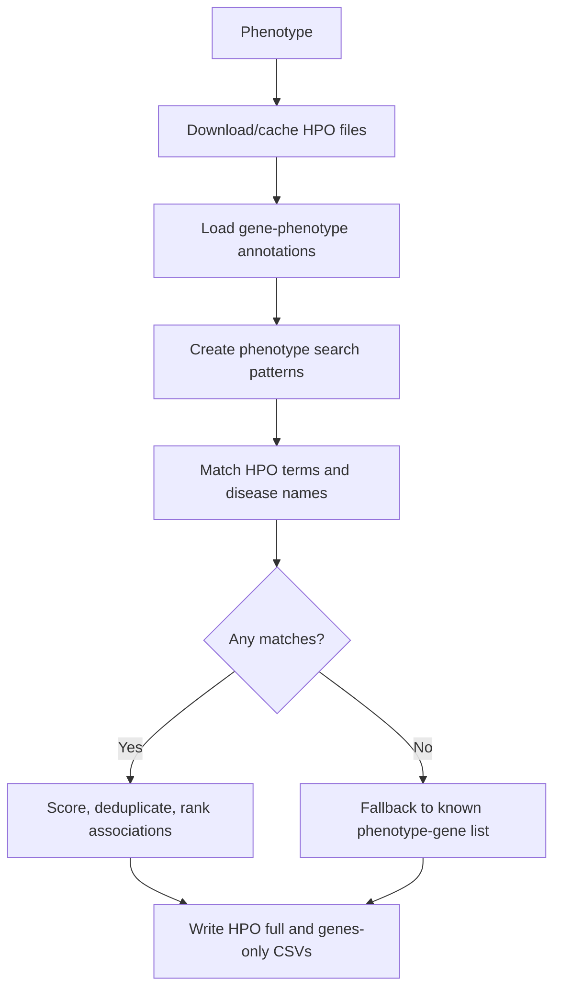

---

#### 9. `gtex.R` - GTEx Dynamic Tissue Prioritization
**Purpose**: Ranks tissues by phenotype-specific literature support, then collects significant eGenes.

**Required Packages**: `gtexr`, `dplyr`, `httr`, `jsonlite`

**Command**: `Rscript gtex.R <phenotype> [q_threshold] [max_genes_per_tissue] [max_tissues]`

**Primary outputs**:
- `{phenotype}_gtex_ranked_tissues.csv`
- `{phenotype}_gtex_tissue_eqtls.csv`
- `{phenotype}_gtex_prioritized_genes.csv`
- `{phenotype}_gtex_genes.csv`

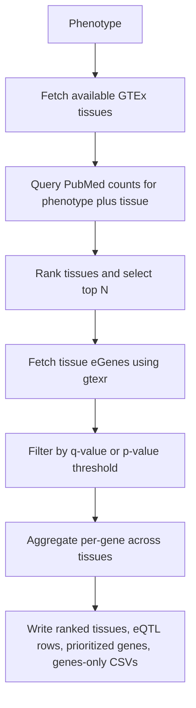

---

#### 10. `uniprot.R` - UniProt
**Purpose**: Executes multiple reviewed-human UniProt queries and extracts primary/synonym gene names.

**Required Packages**: `httr`, `jsonlite`

**Command**: `Rscript uniprot.R <phenotype>`

**Primary outputs**:
- `{phenotype}_uniprot.csv`
- `{phenotype}_uniprot_genes.csv`

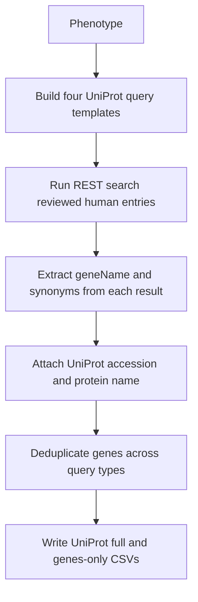

---

#### 11. `opentargets.R` - Open Targets
**Purpose**: Finds disease ID by phenotype term, then paginates associated targets.

**Required Packages**: `httr`, `jsonlite`

**Command**: `Rscript opentargets.R <phenotype>`

**Primary outputs**:
- `{phenotype}_opentargets.csv`
- `{phenotype}_opentargets_genes.csv`

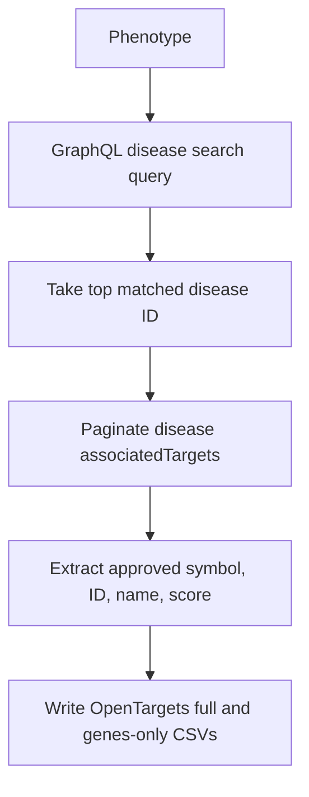

---

#### 12. `gwasrapidd.R` - GWAS Catalog
**Purpose**: Expands phenotype terms and queries both EFO and reported traits for variant-gene contexts.

**Required Packages**: `gwasrapidd`, `dplyr`

**Command**: `Rscript gwasrapidd.R <phenotype>`

**Primary outputs**:
- `{phenotype}_gwasrapidd.csv`
- `{phenotype}_gwasrapidd_genes.csv`

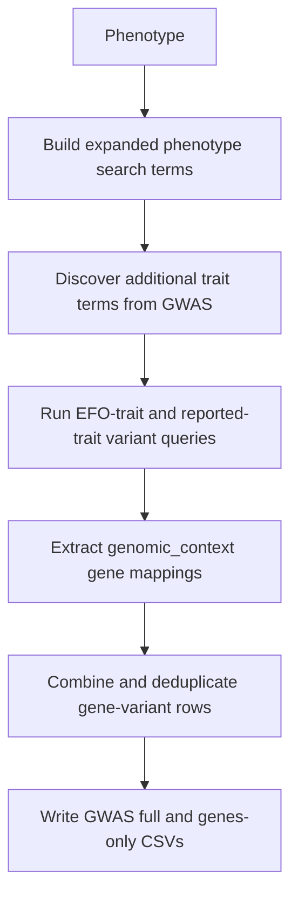

---

### Master Coordination Script

#### `download_genes.R` - Pipeline Coordinator
**Purpose**: Executes configured database scripts in a coordinated manner.

**Features**:
- Smart file existence checking
- Force re-download option (`--force`)
- Progress tracking and error handling
- Comprehensive execution summary
- Combined outputs (`*_ALL_SOURCES_GENES.csv`, `*_SOURCES_SUMMARY.csv`)

**Command**: 
```bash
Rscript download_genes.R <phenotype>
Rscript download_genes.R <phenotype> --force
```

**Execution Flow**:
1. Validates phenotype input
2. Creates `AllPackagesGenes/` output directory
3. Executes each database script sequentially
4. Captures success/failure status and runtime
5. Generates execution summary report

**Repository alignment note**:
- The coordinator currently includes legacy references to `gene_ontology.R` and `pubmed_pubtator.R`.
- The current repository includes `pubmed.R` and does not include `gene_ontology.R`.
- If needed, update the `scripts_info` mapping in `download_genes.R` to keep code and docs fully synchronized.

---

## 📁 Project Structure

```
PhenotypeToGeneDownloaderR/
├── README.md                     # This comprehensive documentation
├── requirements.R                # R package installer script
├── requirements.txt              # Python dependencies
├── environment.yml               # Conda environment file
├── download_genes.R              # Master R coordination script
├── download_genes_analysis.py    # Master Python analysis script
│
├── Individual R Scripts (active in this repository)/
│   ├── pubmed.R                  # PubMed literature mining
│   ├── omim.R                    # OMIM genetic disorders
│   ├── string_db.R               # STRING protein interactions
│   ├── disgenet.R                # DisGeNET gene-disease associations
│   ├── clinvar.R                 # ClinVar clinical variants
│   ├── reactome_pathways.R       # Reactome biological pathways
│   ├── kegg.R                    # KEGG metabolic pathways
│   ├── hpo.R                     # HPO human phenotypes
│   ├── gtex.R                    # GTEx gene expression
│   ├── uniprot.R                 # UniProt protein database
│   ├── opentargets.R             # OpenTargets drug targets
│   └── gwasrapidd.R              # GWAS Catalog associations
│
├── GenePlots/                    # Python analysis modules
│   ├── Analysis1_SourceComparison.py    # Database performance analysis
│   ├── Analysis2_GeneFrequency.py       # Gene frequency distributions
│   ├── Analysis3_DatabaseOverlap.py     # Venn diagrams and overlaps
│   ├── Analysis4_GeneSetEnrichment.py   # Pathway enrichment analysis
│   └── Analysis6_StatisticalSummary.py  # Comprehensive statistics
│
├── AllPackagesGenes/             # R script outputs (CSV files)
└── AllAnalysisGene/              # Python analysis outputs
    ├── plots/                    # Publication-quality visualizations
    ├── reports/                  # Statistical reports and summaries
    └── data/                     # Processed gene lists and metadata
```

## 🔧 Installation and Requirements

### R Dependencies

**Install all dependencies automatically:**
```r
Rscript requirements.R
```

**Manual Installation:**

**Core CRAN Packages:**
```r
install.packages(c(
  "dplyr", "readr", "stringr", "httr", "jsonlite", "xml2",
  "rvest", "rentrez", "ontologyIndex", "gtexr", "gwasrapidd", "devtools"
))
```

**Bioconductor Packages:**
```r
if (!require(BiocManager, quietly = TRUE)) {
  install.packages("BiocManager")
}

BiocManager::install(c(
  "ReactomePA", "reactome.db", "org.Hs.eg.db", "AnnotationDbi",
  "KEGGREST"
))

# DisGeNET package is installed from GitLab in disgenet.R
devtools::install_gitlab("medbio/disgenet2r")
```

### Python Dependencies

**Install Python analysis dependencies:**
```bash
pip install -r requirements.txt
```

**Or using conda:**
```bash
conda env create -f environment.yml
conda activate gene-analysis
```

## 📊 Output Formats and Data Structure

### R Script Outputs (`AllPackagesGenes/`)

Outputs are **source-specific** (not a single universal schema). Each script writes at least one full CSV and a genes-only CSV.

**Core per-source outputs:**
- PubMed: `{phenotype}_pubmed_pubtator.csv`, `{phenotype}_pubmed_genes.csv`
- OMIM: `{phenotype}_omim.csv`, `{phenotype}_omim_genes.csv`
- STRING-DB: `{phenotype}_string_db.csv`, `{phenotype}_string_db_genes.csv`
- DisGeNET: `{phenotype}_disgenet.csv`, `{phenotype}_disgenet_genes.csv`
- ClinVar: `{phenotype}_clinvar.csv`, `{phenotype}_clinvar_genes.csv`
- Reactome: `{phenotype}_reactome_pathways.csv`, `{phenotype}_reactome_pathways_genes.csv`
- KEGG: `{phenotype}_kegg.csv`, `{phenotype}_kegg_genes.csv`, `{phenotype}_kegg_pathways.csv`
- HPO: `{phenotype}_hpo.csv`, `{phenotype}_hpo_genes.csv`
- GTEx: `{phenotype}_gtex_ranked_tissues.csv`, `{phenotype}_gtex_tissue_eqtls.csv`, `{phenotype}_gtex_prioritized_genes.csv`, `{phenotype}_gtex_genes.csv`
- UniProt: `{phenotype}_uniprot.csv`, `{phenotype}_uniprot_genes.csv`
- Open Targets: `{phenotype}_opentargets.csv`, `{phenotype}_opentargets_genes.csv`
- GWAS Catalog: `{phenotype}_gwasrapidd.csv`, `{phenotype}_gwasrapidd_genes.csv`

**Combined coordinator outputs:**
- `{phenotype}_ALL_SOURCES_GENES.csv`
- `{phenotype}_SOURCES_SUMMARY.csv`

**Example real column sets:**
- `*_pubmed_pubtator.csv`: `Gene`, `Entrez_ID`, `PMID_Count`, `Supporting_PMIDs`, `Phenotype`, `Source`
- `*_clinvar.csv`: `Gene`, `ClinVar_VariationID`, `ClinVar_Accession`, `Query_Phenotype`, `Matched_Condition`, `Clinical_Significance`, `Search_Term`, `Source`
- `*_kegg.csv`: `Phenotype`, `Pathway_ID`, `Pathway_Name`, `KEGG_Gene_ID`, `Gene`, `Source`
- `*_gwasrapidd.csv`: `Gene`, `Variant_ID`, `Chromosome`, `Position`, `Distance`, `Is_Mapped_Gene`, `Is_Closest_Gene`, ...

### Python Analysis Outputs (`AllAnalysisGene/`)

**Directory Structure:**
```
AllAnalysisGene/
├── plots/                    # Publication-quality visualizations (PNG, PDF)
├── reports/                  # Statistical summaries and data tables (CSV, TXT)
└── data/                     # Processed gene lists and metadata
```

**Generated Files:**
- `{phenotype}_Analysis2_GeneFrequency.png/pdf`
- `{phenotype}_Analysis3_DatabaseOverlap.png/pdf`
- `{phenotype}_Analysis3_AllPairwiseVenns.png/pdf`
- `{phenotype}_Analysis3_ThreeWayVenns.png/pdf`
- `{phenotype}_Analysis3_TopDatabaseVenns.png/pdf`
- `{phenotype}_Analysis3_VennDiagrams.png/pdf`
- `{phenotype}_Analysis3_SimilarityHeatmap.png/pdf`
- `{phenotype}_Analysis4_GeneSetEnrichment.png/pdf`
- `{phenotype}_Analysis6_StatisticalSummary.png/pdf`
- `{phenotype}_ExecutiveSummary.txt`
- `{phenotype}_Analysis2_GeneFrequency_Report.csv`
- `{phenotype}_Analysis3_OverlapSummary.csv`
- `{phenotype}_Analysis4_EnrichmentResults.csv`
- `{phenotype}_Analysis6_FinalSummary.csv`
- `{phenotype}_all_genes.csv`
- `{phenotype}_summary_stats.csv`

## 🚀 Usage Examples

### Basic Pipeline Execution

```bash
# Complete pipeline for migraine research
Rscript download_genes.R migraine
python download_genes_analysis.py migraine

# Complete pipeline for diabetes research
Rscript download_genes.R diabetes
python download_genes_analysis.py diabetes
```

### Individual Database Queries

```bash
# Query specific databases
Rscript pubmed.R migraine
Rscript omim.R migraine
Rscript string_db.R migraine
```

### Force Re-download

```bash
# Ignore existing files and re-download
Rscript download_genes.R migraine --force
```

### Interactive R Usage

```r
# Load and run individual scripts
source("pubmed.R")
migraine_results <- download_pubmed_pubtator_genes("migraine")

# View results
head(migraine_results$summary)
table(migraine_results$summary$Source)
```

## 🎨 Analysis and Visualization Features

### Python Analysis Suite

The Python analysis pipeline generates comprehensive visualizations and statistical reports:

**1. Source Comparison Analysis**
- Database performance metrics
- Gene count comparisons
- Success rate analysis
- Execution time tracking

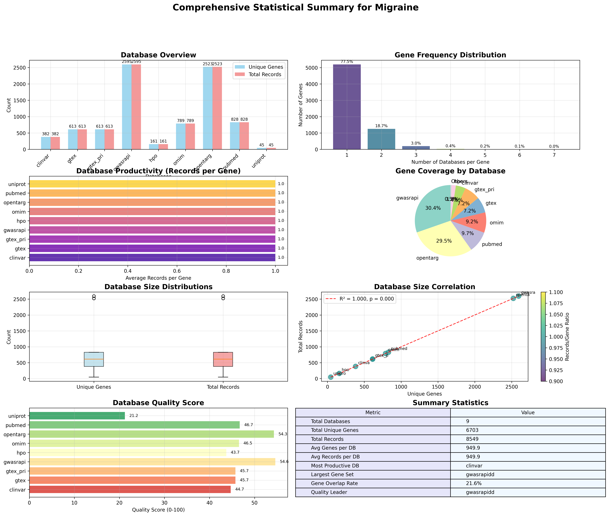
*Example: Database performance comparison showing gene counts and success rates across all available databases*

**2. Gene Frequency Analysis**
- Gene occurrence across databases
- Most frequently identified genes
- Database-specific gene distributions
- Statistical frequency analysis

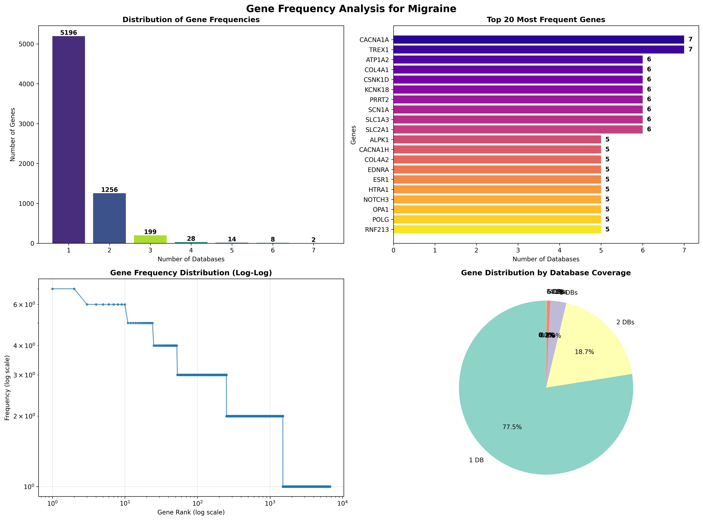
*Example: Gene frequency distribution showing how often genes appear across different databases*

**3. Database Overlap Analysis**
- **Comprehensive Venn Diagrams**: All pairwise combinations
- **Three-way overlaps**: Top-performing database triplets
- **Jaccard Similarity Heatmaps**: Statistical overlap measurements
- **Database-specific legends**: Color-coded identification

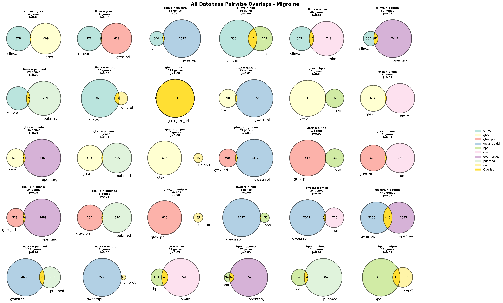
*Example: Comprehensive Venn diagram analysis showing gene overlaps between databases*

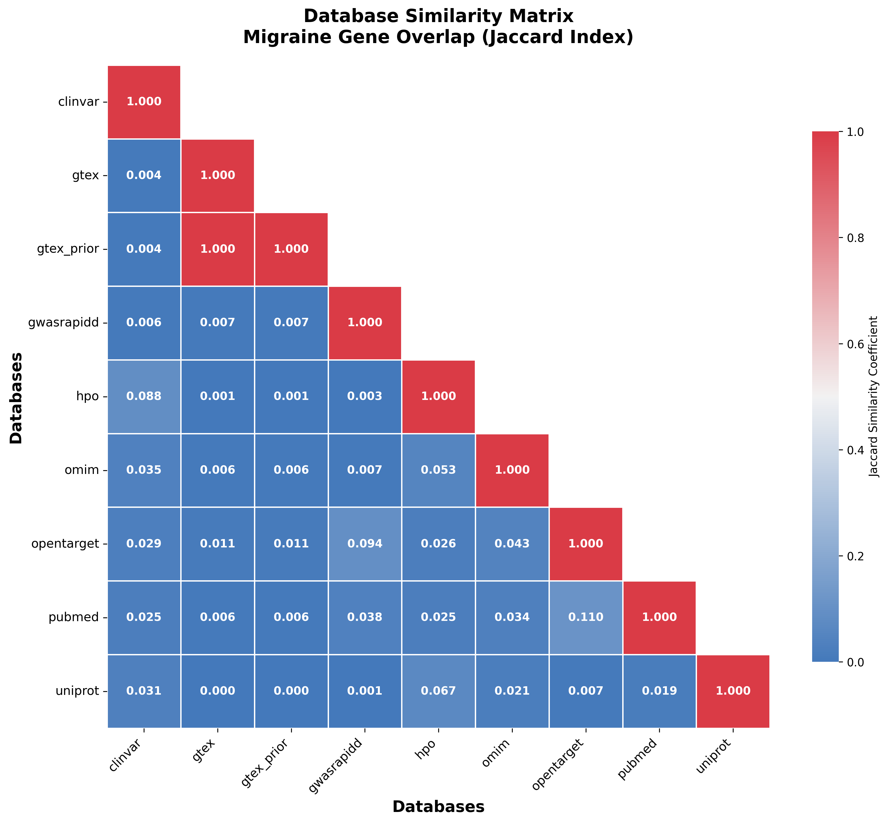
*Example: Jaccard similarity heatmap showing statistical overlap between all database pairs*

**4. Gene Set Enrichment Analysis**
- Pathway enrichment testing
- Functional annotation clustering
- GO term over-representation
- Statistical significance testing

**5. Statistical Summary**
- Executive summary reports
- Comprehensive statistics
- Publication-ready tables
- Key findings and recommendations

### Visualization Quality

All visualizations are generated with:
- **High Resolution**: 300 DPI for publication
- **Multiple Formats**: PNG and PDF outputs
- **Professional Styling**: Consistent color schemes and fonts
- **Statistical Annotations**: P-values and confidence intervals

### Enhanced Venn Diagrams

The pipeline includes sophisticated Venn diagram analysis:
- **All Pairwise Comparisons**: Every database pair analyzed
- **Three-Way Overlaps**: Top-performing database combinations
- **Comprehensive Analysis**: pairwise and multi-database overlap views in one workflow
- **Statistical Annotations**: Jaccard similarity coefficients
- **Database-Specific Legends**: Color-coded database identification


*Example: All pairwise Venn diagrams showing detailed overlap analysis between database pairs*

### Sample Gene Analysis Results

**Individual Gene CSV Files (AllPackagesGenes/)**
Each source writes its own schema. Example from PubMed summary output:

```csv
Gene,Entrez_ID,PMID_Count,Supporting_PMIDs,Phenotype,Source
CACNA1A,773,24,"12345;23456;34567",migraine,PubMed+PubTator3
SCN1A,6323,18,"11111;22222",migraine,PubMed+PubTator3
TRPV1,7442,14,"33333;44444",migraine,PubMed+PubTator3
```

**Comprehensive Analysis Output (AllAnalysisGene/)**

The analysis pipeline generates multiple visualization types:


*Gene count distribution across available databases showing retrieval efficiency*


*Most frequently identified genes across databases with occurrence frequencies*


*Database-specific performance metrics including gene counts, success rates, and execution times*


*Detailed overlap matrix showing shared genes between all database pairs*


*Comprehensive statistical dashboard with key findings and recommendations*

## 🚨 Error Handling and Troubleshooting

### Common Issues and Solutions

**1. Missing R Packages**
```r
# Automatic installation
Rscript requirements.R

# Manual troubleshooting
install.packages("package_name")
BiocManager::install("bioc_package_name")
```

**2. Network and API Issues**
- All scripts include timeout handling
- Rate limiting with automatic delays
- Graceful failure handling
- Retry mechanisms for transient errors

**3. Empty Results**
- Check phenotype spelling and terminology
- Some databases may lack associations for rare conditions
- Verify internet connectivity
- Check database service status

**4. Permission and Directory Issues**
```bash
# Re-run coordinator; it creates required output directories automatically
Rscript download_genes.R migraine
```

### Debug and Verbose Output

**Enable detailed logging:**
```bash
# Python analysis prints execution details to console
python download_genes_analysis.py migraine
```

### Performance Optimization

**Large-scale processing:**
- Scripts handle memory efficiently
- Results are streamed and processed incrementally
- Automatic cleanup of temporary files
- Progress tracking for long-running operations

## 📚 Scientific Background and Methodology

### Gene Discovery Approaches

**1. Literature Mining (PubMed)**
- Natural language processing of abstracts
- Gene mention extraction and validation
- Co-occurrence analysis with phenotype terms
- Evidence strength based on publication frequency

**2. Clinical Databases (ClinVar, OMIM)**
- Curated clinical variant annotations
- Genetic disorder classifications
- Pathogenicity assessments
- Clinical significance scores

**3. Functional Genomics (GO, KEGG, Reactome)**
- Pathway-based gene discovery
- Functional annotation analysis
- Biological process categorization
- Molecular function mapping

**4. Network Biology (STRING)**
- Protein-protein interaction networks
- Network topology analysis
- Interaction confidence scoring
- Network-based gene prioritization

**5. Expression Analysis (GTEx)**
- Tissue-specific expression profiles
- Expression quantitative trait loci (eQTLs)
- Co-expression network analysis
- Expression level thresholding

### Statistical Validation

**Overlap Analysis:**
- Jaccard similarity coefficients
- Hypergeometric enrichment testing
- Multiple testing correction (FDR)
- Bootstrap confidence intervals

**Quality Metrics:**
- Database coverage assessment
- Gene annotation completeness
- Cross-database validation
- Evidence aggregation scoring

## 🤝 Contributing and Development

### Contributing Guidelines

**Bug Reports:**
1. Check existing issues
2. Provide reproducible examples
3. Include system information (R version, OS)
4. Attach relevant error messages

**Feature Requests:**
1. Describe the use case
2. Suggest implementation approach
3. Consider backwards compatibility
4. Provide example workflows

**Code Contributions:**
1. Follow existing coding style
2. Include documentation and comments
3. Add appropriate error handling
4. Test with multiple phenotypes

### Development Setup

```bash
# Clone repository
git clone https://github.com/MuhammadMuneeb007/PhenotypeToGeneDownloaderR.git
cd PhenotypeToGeneDownloaderR

# Install development dependencies
Rscript requirements.R
pip install -r requirements.txt

# Run test suite
Rscript test_all_modules.R
python -m pytest tests/
```

### Code Architecture

**R Scripts:**
- Modular design with standard functions
- Consistent error handling patterns
- Standardized output formats
- Configurable parameters

**Python Analysis:**
- Object-oriented analysis modules
- Reproducible visualization pipeline
- Statistical analysis framework
- Extensible reporting system

## 📄 License and Citation

### License

This project is licensed under the MIT License. See `LICENSE` file for full details.

### Citation

 

### Database Citations

Please also cite the original databases:

- **PubMed**: NCBI Resource Coordinators (2018) Database resources of the National Center for Biotechnology Information. Nucleic Acids Research.
- **OMIM**: Amberger et al. (2019) OMIM.org: leveraging knowledge across phenotype-gene relationships. Nucleic Acids Research.
- **STRING**: Szklarczyk et al. (2023) The STRING database in 2023: protein-protein association networks and functional enrichment analyses for any sequenced genome of interest. Nucleic Acids Research.
- **DisGeNET**: Piñero et al. (2020) The DisGeNET knowledge platform for disease genomics: 2019 update. Nucleic Acids Research.
- **ClinVar**: Landrum et al. (2020) ClinVar: improvements to accessing data. Nucleic Acids Research.
- **Reactome**: Gillespie et al. (2022) The reactome pathway knowledgebase 2022. Nucleic Acids Research.
- **KEGG**: Kanehisa et al. (2023) KEGG for taxonomy-based analysis of pathways and genomes. Nucleic Acids Research.
- **HPO**: Köhler et al. (2021) The Human Phenotype Ontology in 2021. Nucleic Acids Research.
- **GTEx**: GTEx Consortium (2020) The GTEx Consortium atlas of genetic regulatory effects across human tissues. Science.
- **UniProt**: UniProt Consortium (2023) UniProt: the Universal Protein Knowledgebase in 2023. Nucleic Acids Research.
- **Open Targets**: Ochoa et al. (2023) The next-generation Open Targets Platform: reimagined, redesigned, rebuilt. Nucleic Acids Research.
- **GWAS Catalog**: Sollis et al. (2023) The NHGRI-EBI GWAS Catalog: knowledgebase and deposition resource. Nucleic Acids Research.
- **Gene Ontology**: Ashburner et al. (2000) Gene ontology: tool for the unification of biology. Nature Genetics.

## 🆘 Support and Contact

### Getting Help

**Documentation:**
- This comprehensive README
- Inline code comments
- Script-specific help messages

**Community Support:**
- [GitHub Issues](https://github.com/MuhammadMuneeb007/PhenotypeToGeneDownloaderR/issues)
- [GitHub Discussions](https://github.com/MuhammadMuneeb007/PhenotypeToGeneDownloaderR/discussions)

## 👨‍💼 Author Information

- **Name**: Muhammad Muneeb
- **Affiliation**: The University of Queensland
- **Email**: [m.muneeb@uq.edu.au](mailto:m.muneeb@uq.edu.au)
- **Gmail**: [muneebsiddique007@gmail.com](mailto:muneebsiddique007@gmail.com)
- **GitHub**: [GitHub Profile](https://github.com/MuhammadMuneeb007/)
- **Google Scholar**: [Google Scholar](https://scholar.google.com/citations?hl=en&user=X0xdltIAAAAJ&view_op=list_works&sortby=pubdate)
- **ResearchGate**: [ResearchGate Profile](https://www.researchgate.net/profile/Muhammad-Muneeb-5)
- **Supervisor**: [David Ascher](https://scmb.uq.edu.au/profile/8654/david-ascher)
- **Group Webpage**: [BioSig Lab](https://biosig.lab.uq.edu.au/)

**Direct Contact:**
- **Maintainer**: [Muhammad Muneeb](mailto:m.muneeb@uq.edu.au)
- **Institution**: The University of Queensland
- **Research Group**: [BioSig Lab](https://biosig.lab.uq.edu.au/)

### Reporting Issues

When reporting issues, please include:

1. **System Information**: OS, R version, Python version
2. **Error Messages**: Complete error logs
3. **Reproducible Example**: Minimal working example
4. **Expected Behavior**: What should have happened
5. **Actual Behavior**: What actually happened

### Feature Requests

For new features, please describe:

1. **Use Case**: Scientific problem to solve
2. **Proposed Solution**: How it should work
3. **Alternative Approaches**: Other ways to address the need
4. **Implementation Details**: Technical considerations

---

**Last Updated**: April 9, 2026  
**Version**: 1.0.0  
**Maintainer**: [Muhammad Muneeb](mailto:m.muneeb@uq.edu.au)  
**License**: MIT License
